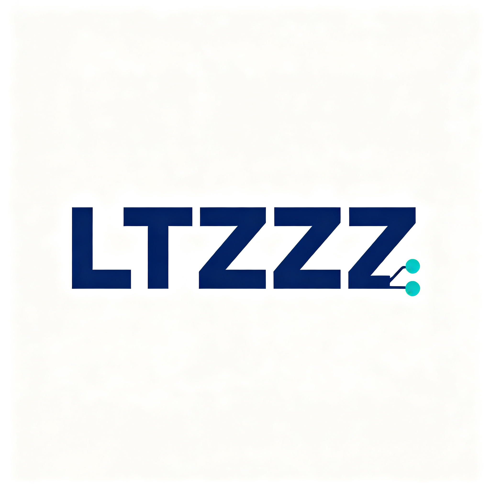
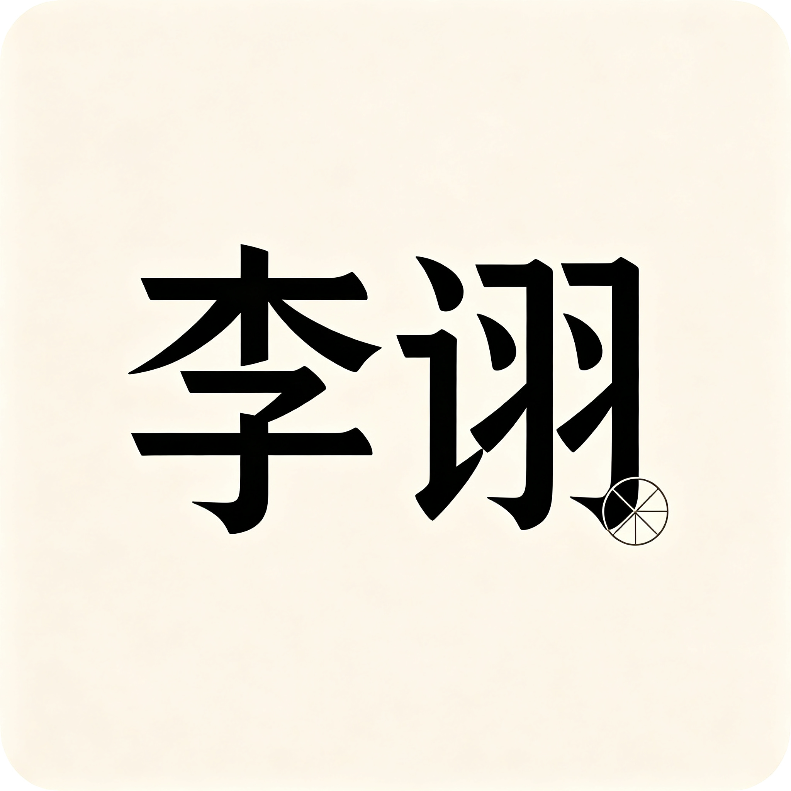
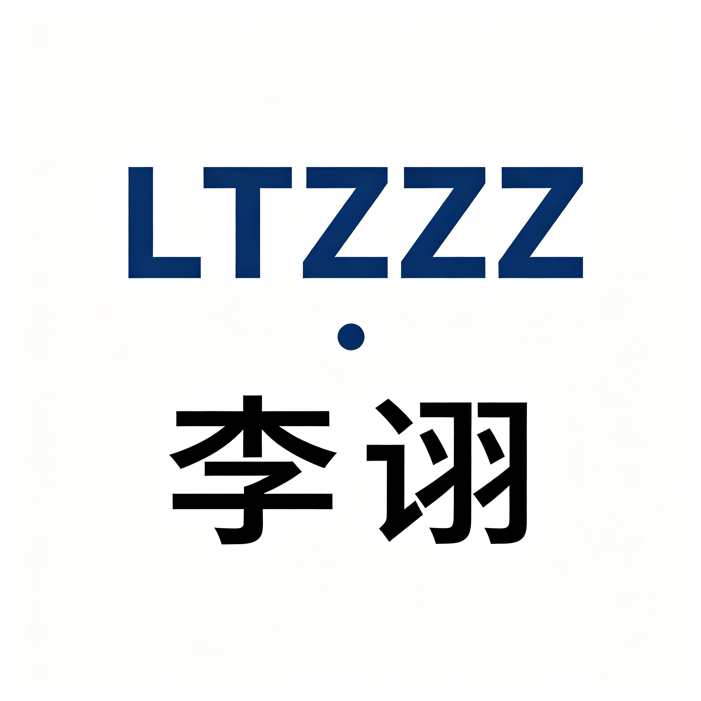

# LTZZZ 品牌名 + Logo 候选方案集

> ⚠️ **等待用户选定**：以下三个方案均为候选，未拍板前**不改动** `index.html` 标题、各 bot 文案与站点现有 favicon。**选定后再统一替换全站标题、bot 文案、favicon。**

---

## 一、三方案总览对照表

| 维度 | 方案 A：品牌延续 | 方案 B：全新中文名 | 方案 C：双标识组合 |
|---|---|---|---|
| **品牌名主张** | LTZZZ AGI 实验室 | 李诩 | LTZZZ·李诩 |
| **Logo 图** |  |  |  |
| **图片路径** | `./brand-option-a.png` | `./brand-option-b.png` | `./brand-option-c.png` |
| **视觉气质** | 科技 / AI 实验风：字母标 LTZZZ 为主图形，点缀网络节点·电路符号 | 东方人文 + 科技融合风："李诩"二字为视觉中心，配极简经纬圆符号 | 双标识并列风：英文 LTZZZ 字母标 + 中文"李诩"上下组合 |
| **Telegram 头像** | 英文辨识度高，国际化友好 | 中文在海外用户端识别成本高 | 双语兼顾，头像缩小时文字偏多 |
| **WhatsApp 头像** | 单色字母+节点，小尺寸清晰 | 单字大字，小尺寸最清晰 | 双层文字，小尺寸略拥挤 |
| **Facebook 头像** | 科技感强，适合机构号 | 人文气质，适合个人 IP 号 | 兼顾官方感与个人 IP |
| **X 头像** | 极客/AI 圈认知快 | 需配合简介解释来历 | 双语对照，传播解释成本低 |
| **网站 favicon（32×32）** | 字母标可缩为"LT"+节点，可行 | "诩"单字可辨，最佳 | 双层字缩到 32px 会糊，需另做简化版 |

---

## 二、逐方案点评

### 方案 A：现用品牌延续 ——「LTZZZ AGI 实验室」

- **推荐语**：零迁移成本，现有域名、外链、bot 昵称、用户认知全部沿用，今晚就能上线换头像。
- **风险/代价**：品牌人格化弱，"实验室"定位偏技术机构，难以承载你近期强调的个人修行与观点输出；英文缩写对国内普通用户缺乏记忆点。

### 方案 B：新中文名 ——「李诩」

- **推荐语**：两个字就是全部资产，东方人文调性极强，favicon 和头像在任何小尺寸下都最干净，适合做长期个人 IP。
- **风险/代价**：与现有 "LTZZZ" 域名、英文社交 handle 完全断裂，老用户认知需要重新教育；"李诩"在海外平台（X/Telegram）的搜索与拼写门槛高；且中文重名商标需另行排查。

### 方案 C：双标识组合 ——「LTZZZ·李诩」

- **推荐语**：一站过渡——老资产（LTZZZ）不丢，新人设（李诩）立起来，双语用户都能接住。
- **风险/代价**：信息密度最大，头像/favicon 缩到小尺寸时两层文字必然模糊，需额外出一版简化图形标；对外介绍时名字偏长，社交 handle 仍只能二选一。

---

## 三、待用户拍板事项

1. 选定方案（A / B / C）。
2. 确认后再执行：
   - 替换 `index.html` 及各页面标题；
   - 统一替换 Telegram / WhatsApp / Facebook / X 各 bot 文案中的品牌名；
   - 从选定 logo 裁剪生成 favicon（推荐 32×32、180×180 两档）；
   - 如选 C，需另行设计小尺寸简化图形标。

> 当前状态：**仅产出候选素材，未改动任何线上文案**。
